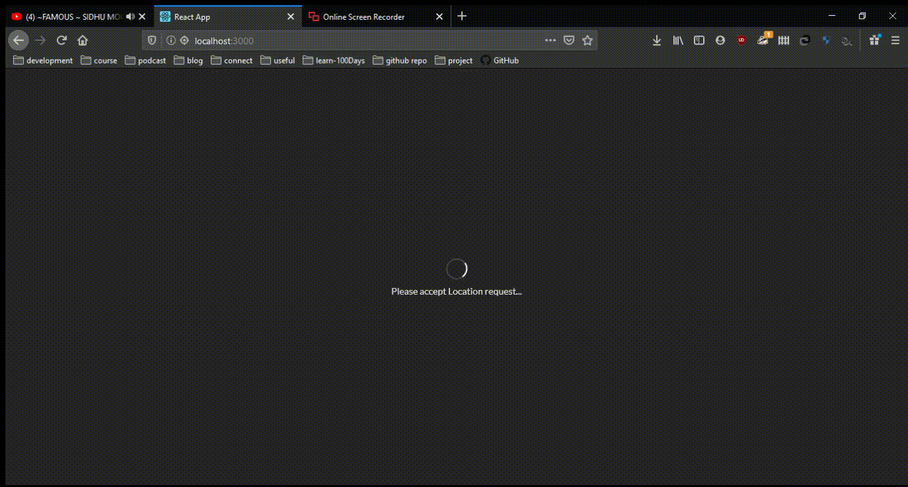
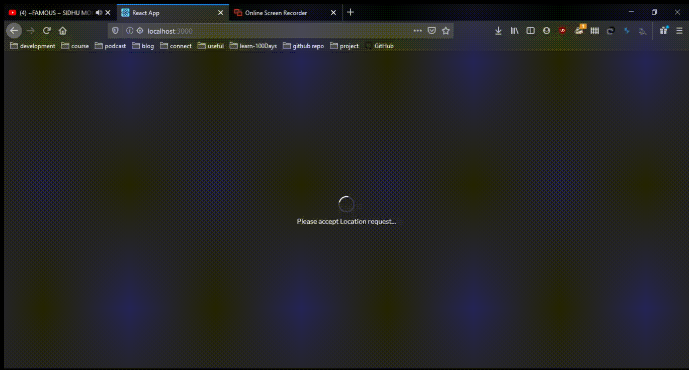
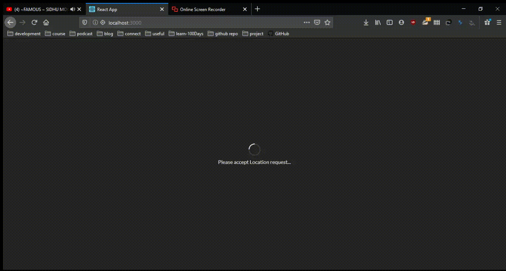

# This project was bootstrapped with [Create React App](https://github.com/facebook/create-react-app)

## What is this project

* According to your location this will show which season is in your location.
* This project had been built for learning purpose, Class based components has been used to built this webApp.
* **navigator.geolocation** api is used to fetch the location.
* This Project is using [semantic ui](https://semantic-ui.com/) for css.

* When summer in your area.

* When winter in your area.

* If location access in not allowed

## To start the project

Install dependencies, run `npm install` and then run `npm start`

This will run the app in the development mode. 
Open [http://localhost:3000](http://localhost:3000) to view it in the browser.

The page will reload if you make edits. 
You will also see any lint errors in the console.
