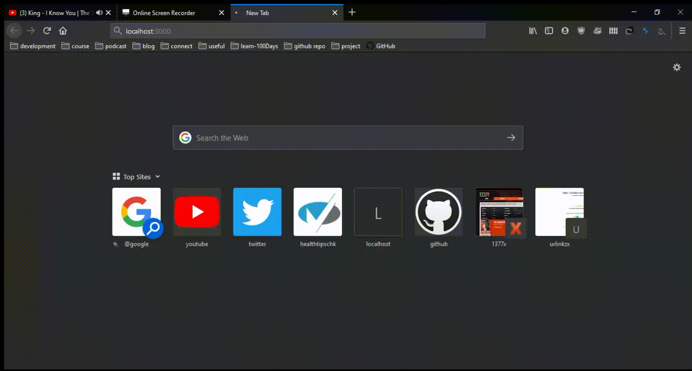

# This project was bootstrapped with [Create React App](https://github.com/facebook/create-react-app)

## What is this project

* This is a video search webApp which accept a query and fetches list of related videos for your query from [YouTube](https://developers.google.com/youtube/v3/docs/) api. By deafault it loads only 10 videos for the search term.

* You can increase the number by changing the **youtube api file** [here](/video-search-app/src/api/youtube.js). Search for *maxResults* and change as per your need. Also you need **add your google api key** to *access youtube apis*

* First time the WebApp loads it displays popular videos based on your region *(default region is set as INDIA)*.

* You can change the region, by changing the **youtube api file** [here](/src/api/youtube.js). Seach the keyword *regionCode* and change its value of your choice (like UK, US, SG etc.).

* This Project is using [semantic ui](https://semantic-ui.com/) for css.  

## Future Work

* Improved Landing page.
* Add pagination(load more videos).

## To start the project

Install dependencies, run `npm install` and then run `npm start`

This will run the app in the development mode. 
Open [http://localhost:3000](http://localhost:3000) to view it in the browser.

The page will reload if you make edits. 
You will also see any lint errors in the console.
